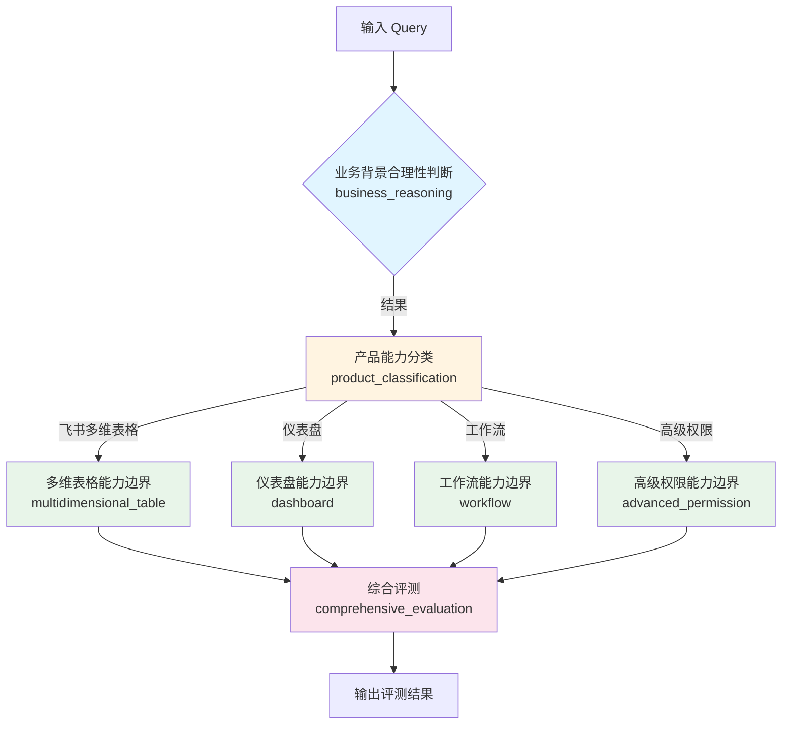

# 自动化 Query 评测系统

基于 LLM + LangGraph 的 Query 评测系统，用于判断 Query 的业务合理性、产品分类和能力边界。

## 📋 系统流程图



## 📁 项目结构

```
query_validity_Checkfeishu/
├── main.py                          # 主入口程序
├── requirements.txt                 # 依赖列表
├── README.md                        # 使用说明
│
├── core/                           # 核心模块
│   ├── __init__.py
│   ├── config.py                   # API 配置
│   └── query_evaluator.py          # 核心评测逻辑和节点流程
│
└── prompts/                        # 提示词模块
    ├── __init__.py
    ├── business_reasoning_prompt.py          # 提示词1：业务场景判断
    ├── product_classification_prompt.py      # 提示词2：产品分类
    ├── multidimensional_table_prompt.py      # 提示词3：多维表格能力边界
    ├── dashboard_prompt.py                   # 提示词4：仪表盘能力边界
    ├── workflow_prompt.py                    # 提示词5：工作流能力边界
    ├── advanced_permission_prompt.py         # 提示词6：高级权限能力边界
    └── comprehensive_evaluation_prompt.py    # 提示词7：综合评测
```

## 🚀 快速开始

### 1. 安装依赖

```bash
pip install -r requirements.txt
```

### 2. 配置 API（可选）

如果需要修改 API 配置，请编辑 [core/config.py](core/config.py)：

```python
ARK_API_KEY = "你的API密钥"
ARK_MODEL_ID = "你的模型ID"
```

### 3. 运行评测

```bash
python main.py
```

## 三种使用模式

### 模式1：运行预设测试用例
自动运行预设的 5 个测试 Query，查看系统效果。

### 模式2：手动输入
交互式输入 Query 进行评测，输入 `quit` 退出。

### 模式3：批量评测
从文件中读取多个 Query 进行评测，每行一个 Query，结果自动保存为 JSON 文件。

## 在代码中使用

```python
from core.query_evaluator import evaluate_query

# 评测一个 Query
result = evaluate_query("创建一个自动审批采购流程")
print(result)
```

## 评测流程说明

1. **业务背景合理性判断**：判断 Query 是否符合真实业务场景
2. **产品能力分类**：将 Query 归类到对应的产品（多维表格/仪表盘/工作流/高级权限）
3. **能力边界判断**：根据产品分类，判断 Query 是否在该产品能力范围内
4. **综合评测**：输出最终评测结果

## 输出结果

```json
{
  "query": "创建一个自动审批采购流程",
  "is_real_business_scenario": true,
  "business_reason": "符合企业审批场景",
  "business_problem": "",
  "product_category": "工作流",
  "within_ability_scope": true,
  "ability_reason": "工作流支持审批流程",
  "final_result": "合理且可执行",
  "reason": "综合评测说明"
}
```

